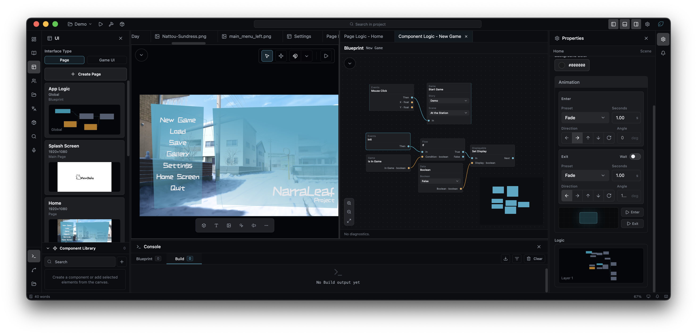
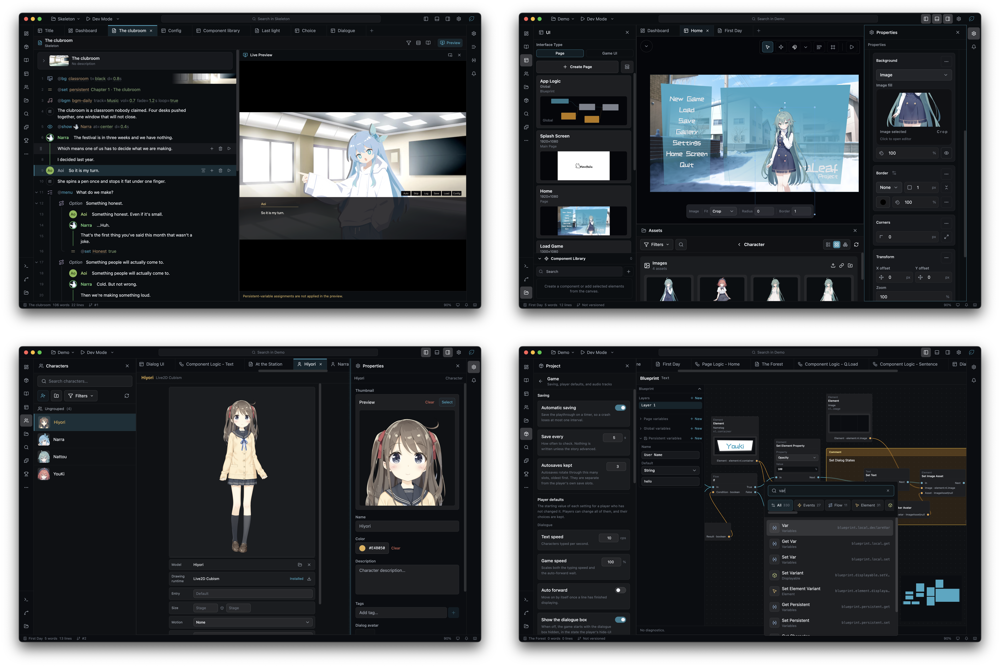
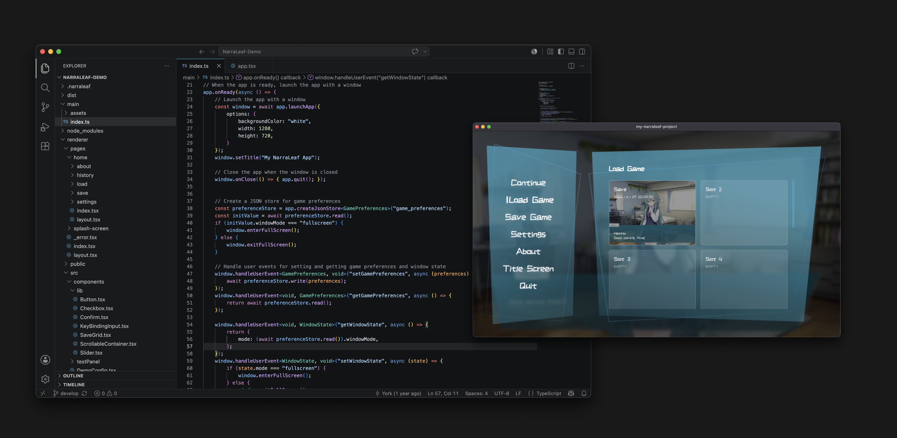

<picture>
  <source media="(prefers-color-scheme: dark)" srcset="https://raw.githubusercontent.com/NarraLeaf/.github/refs/heads/master/doc/banner-md-transparent.png">
  <source media="(prefers-color-scheme: light)" srcset="https://raw.githubusercontent.com/NarraLeaf/.github/refs/heads/master/doc/banner-md-light.png">
  
</picture>

<h1 align="center">NarraLeaf Project</h1>

<h4 align="center">A new definition of Visual Novel. </h3>

English | <a href="./README-zh.md">简体中文</a>

<a href="https://narraleaf.com">Official Website</a>

NarraLeaf Project is a modern visual novel game engine that provides multiple solutions. From flexible integration to unified development, it helps unleash creators' creativity.

## Solutions

### [NarraLeaf Studio](https://github.com/NarraLeaf/NarraLeaf-Studio) - All-in-One Visual Novel IDE

Zero-code, all-in-one visual novel IDE.

An editor that includes all essential development workflows. No coding required. Start unleashing your creativity anytime.

### [NarraLeaf](https://github.com/NarraLeaf/NarraLeaf) – Complete Desktop Solution

A Node.js library and CLI tool for handling every part of the development workflow.

Build cross-platform visual novels for desktop as easily as creating a React app. NarraLeaf handles everything else for you; like game flow, testing, and packaging.

### [NarraLeaf-React](https://github.com/NarraLeaf/narraleaf-react) - Embedded VN Player Solution

A lightweight front-end visual novel player built for React.

NarraLeaf-React delivers everything you need for compelling storytelling: narratives, interfaces, and performance. With its simple, intuitive API, bring your stage to any web platform.

### [NarraLeaf Team](https://github.com/NarraLeaf/NarraLeaf-Team) - Team Collaboration Solution

The collaboration solution for NarraLeaf Studio.

Team deploys easily onto a device on your own network or a remote container, and gives everyone on the team central version management and real-time collaboration (in development). With Team, creators sync the team's projects and start working right away.

## More Projects

### [@NarraLeaf/CharPack](https://github.com/NarraLeaf/CharPack)

Image compression tool for optimizing character assets

### [@NarraLeaf/Sound](https://github.com/NarraLeaf/Sound)

A lightweight and modern HTML audio management solution, suitable for simple web games.

### [NarraLang](https://github.com/NarraLeaf/NarraLang)

Eliminate code with simpler language

### [NarraLeaf Demo](https://github.com/NarraLeaf/NarraLeaf-Demo)

Simple demo project for NarraLeaf.
